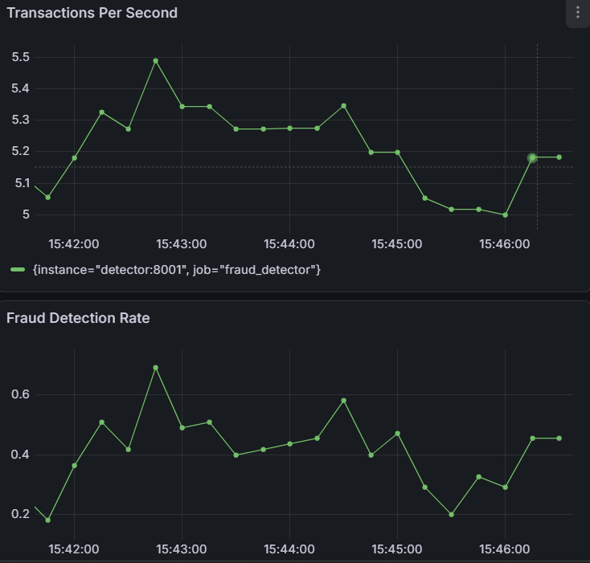
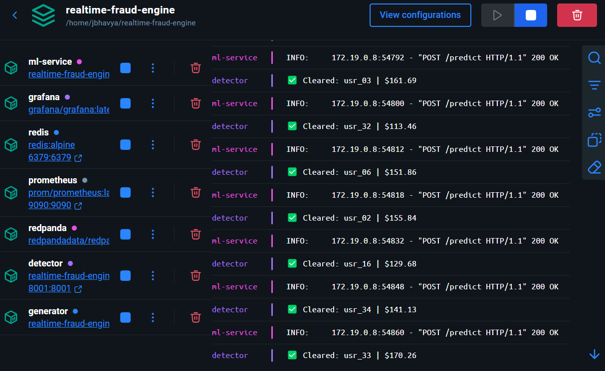

# ⚡ Real-Time Fraud Detection Engine

> A production-grade, stream-processing fraud detection system — containerised end-to-end and observable in real time.

Built with **Kafka (Redpanda)**, **Redis**, **XGBoost + SHAP**, **FastAPI**, **Streamlit**, **Prometheus**, and **Grafana**.

---

## 🖼️ Live System Snapshots

### Grafana — Real-Time Metrics Dashboard



_Transactions flowing at ~5.2 TPS with a live fraud detection rate tracked per second._

---

### Docker — All Services Running



_All 8 containers running in sync. The detector and ML service communicate on every transaction._

---

## 🏗️ Architecture

```
┌─────────────────┐     Kafka Topic        ┌──────────────────────┐
│  generator.py   │ ──(raw-transactions)──▶ │    detector.py       │
│                 │                         │                      │
│ Simulates 50    │                         │  • Velocity check    │
│ user profiles   │                         │  • Amount anomaly    │
│ w/ fraud        │                         │  • Location mismatch │
│ injection       │                         │  • ML inference call │
└─────────────────┘                         └────────┬─────────────┘
                                                     │ HTTP POST /predict
                                          ┌──────────▼──────────┐
        ┌──────────────────────┐          │    ml_service.py     │
        │       Redis          │◀────────▶│                      │
        │  User profiles &     │          │  XGBoost classifier  │
        │  TX velocity state   │          │  + SHAP explainability│
        └──────────────────────┘          └──────┬────────┬──────┘
                                                 │        │ HTTP POST /batch-analyze
                                    ┌────────────▼─┐  ┌───▼──────────────┐
                                    │  Prometheus  │  │    app.py        │
                                    │  + Grafana   │  │  Streamlit UI    │
                                    │  (:8001 src) │  │  FraudOps Portal │
                                    └──────────────┘  └──────────────────┘
```

### Services at a Glance

| Service        | File / Image            | Port             | Role                                          |
| -------------- | ----------------------- | ---------------- | --------------------------------------------- |
| **Generator**  | `generator.py`          | —                | Produces synthetic transactions to Kafka      |
| **Detector**   | `detector.py`           | `8001` (metrics) | Consumes, applies rules + ML, emits verdicts  |
| **ML Service** | `ml_service.py`         | `8000`           | XGBoost inference + SHAP explanations         |
| **Frontend**   | `app.py`                | `8501`           | Streamlit FraudOps Portal (live view + batch) |
| **Redpanda**   | `redpandadata/redpanda` | `19092`          | Kafka-compatible message broker               |
| **Redis**      | `redis:alpine`          | `6379`           | User profiles + velocity state store          |
| **Prometheus** | `prom/prometheus`       | `9090`           | Metrics scraper                               |
| **Grafana**    | `grafana/grafana`       | `3000`           | Dashboards                                    |

---

## 🧠 How Fraud Is Detected

The detector applies a **layered defence** strategy per transaction:

1. **Rule-Based Checks** (fast, synchronous)
   - 📈 **Amount Anomaly** — flags if amount > 5× the user's historical average
   - 🚀 **Velocity Anomaly** — flags 5+ transactions within 60 seconds
   - 🌍 **Location Anomaly** — flags transactions outside the user's home region

2. **ML Inference** (XGBoost via HTTP, 500 ms timeout)
   - Features: `amount`, `user_avg_amount`, `amount_ratio`, `location_mismatch`, `is_international`
   - Threshold: fraud probability > **80%**
   - **SHAP values** generate human-readable explanations for every positive prediction

3. **Cold-Start Handling** — new/unknown users fall back to safe defaults so the system never crashes on missing profiles.

---

## 🚀 Quickstart

### Prerequisites

- [Docker](https://docs.docker.com/get-docker/) & Docker Compose
- Python 3.9+ (only for local runs / model retraining)

### 1 — Clone & spin up infrastructure

```bash
git clone <your-repo-url>
cd realtime-fraud-engine
docker compose up -d
```

This starts Redpanda, Redis, Prometheus, Grafana, the ML service, detector, generator, and the Streamlit frontend automatically.

### 2 — Seed user profiles into Redis

> **⚠️ Important:** If you have a local Redis instance running on port 6379, the `setup_redis.py` script will hit it instead of the Docker Redis container. Use the command below to seed directly into the correct container.

```bash
# Recommended — seeds directly into the Docker Redis container (works regardless of local Redis)
bash -c '
LOCATIONS=("NY" "CA" "TX" "FL" "IL")
{ echo "FLUSHALL"
  for i in $(seq -w 0 49); do
    LOC="${LOCATIONS[$((RANDOM % 5))]}"
    AVG=$(awk "BEGIN{printf \"%.2f\", 10 + rand() * 140}")
    STD=$(awk "BEGIN{printf \"%.2f\", 2 + rand() * 13}")
    echo "SET user_profile:usr_${i} {\"user_id\":\"usr_${i}\",\"base_location\":\"${LOC}\",\"avg_transaction_amount\":${AVG},\"std_dev_amount\":${STD}}"
  done
} | docker exec -i redis redis-cli --pipe
'
```

Creates 50 synthetic user profiles, each with a home location, average spend, and spend volatility.

### 3 — Start the application stack

```bash
docker compose up --build
```

Or run each service individually for development:

```bash
# Terminal 1 — ML inference API
uvicorn ml_service:app --reload --port 8000

# Terminal 2 — Fraud detector
python detector.py

# Terminal 3 — Transaction generator
python generator.py

# Terminal 4 — Streamlit FraudOps Portal
streamlit run app.py --server.port 8501
```

### 4 — Train the ML model (optional)

```bash
python train_model.py
```

Generates ~10,000 labelled transactions, trains an XGBoost classifier, fits a SHAP TreeExplainer, and saves both as pickle artifacts (`fraud_model.pkl`, `shap_explainer.pkl`).

> **Pre-trained artifacts** are already committed — skip this step if you just want to run the engine.

---

## 🗂️ Project Structure

```
realtime-fraud-engine/
├── generator.py        # Synthetic transaction producer (Kafka)
├── detector.py         # Core stream processor & fraud logic
├── ml_service.py       # FastAPI ML inference endpoint (/predict & /batch-analyze)
├── app.py              # Streamlit FraudOps Portal (live monitoring + batch analysis)
├── train_model.py      # XGBoost + SHAP model training script
├── setup_redis.py      # Seeds user profiles into Redis
├── consumer.py         # Lightweight debug consumer (print-only)
├── test_batch.csv      # Sample CSV for batch analysis testing
├── fraud_model.pkl     # Pre-trained XGBoost model artifact
├── shap_explainer.pkl  # Pre-trained SHAP TreeExplainer artifact
├── requirements.txt    # Python dependencies
├── Dockerfile          # Single image for all Python services
├── docker-compose.yml  # Full stack orchestration (8 services)
├── prometheus.yml      # Prometheus scrape config
└── screenshots/        # Live system snapshots
    ├── grafana_dashboard.png
    └── docker_services.png
```

---

## ⚙️ Configuration

All services read configuration from environment variables with sensible defaults:

| Variable                  | Default                               | Description                          |
| ------------------------- | ------------------------------------- | ------------------------------------ |
| `KAFKA_BROKER`            | `localhost:19092`                     | Kafka / Redpanda bootstrap servers   |
| `KAFKA_TOPIC`             | `raw-transactions`                    | Input topic name                     |
| `OUT_TOPIC`               | `processed-transactions`              | Output topic for verdicts            |
| `REDIS_HOST`              | `localhost`                           | Redis hostname                       |
| `REDIS_PORT`              | `6379`                                | Redis port                           |
| `ML_SERVICE_URL`          | `http://localhost:8000/predict`       | ML inference endpoint (streaming)    |
| `ML_SERVICE_URL_BATCH`    | `http://localhost:8000/batch-analyze` | ML batch analysis endpoint           |
| `PROMETHEUS_URL`          | `http://localhost:9090`               | Prometheus base URL for Streamlit UI |
| `FRAUD_PROBABILITY`       | `0.05`                                | Fraction of injected fraud events    |
| `TRANSACTIONS_PER_SECOND` | `5.0`                                 | Generator throughput rate            |

When running with Docker Compose these are automatically wired to the correct service hostnames.

---

## 📊 Observability

The detector exposes a **Prometheus metrics endpoint** on port `8001`:

| Metric                           | Type      | Description                         |
| -------------------------------- | --------- | ----------------------------------- |
| `transactions_processed_total`   | Counter   | Total transactions consumed         |
| `fraud_caught_total`             | Counter   | Total transactions flagged as fraud |
| `transaction_processing_seconds` | Histogram | Per-transaction processing latency  |

### Access Dashboards & UIs

| Tool            | URL                                                                       |
| --------------- | ------------------------------------------------------------------------- |
| FraudOps Portal | [http://localhost:8501](http://localhost:8501) (Streamlit live + batch)   |
| Prometheus      | [http://localhost:9090](http://localhost:9090)                            |
| Grafana         | [http://localhost:3000](http://localhost:3000) (default: `admin`/`admin`) |
| ML API Docs     | [http://localhost:8000/docs](http://localhost:8000/docs) (Swagger UI)     |
| Raw Metrics     | [http://localhost:8001/metrics](http://localhost:8001/metrics)            |

To visualise fraud metrics in Grafana, add Prometheus as a data source (`http://prometheus:9090`) and create panels using the metrics above.

---

## 🔌 ML Service API

### `POST /predict` — Real-Time Single Transaction

```json
// Request
{
  "amount": 850.00,
  "user_avg_amount": 45.00,
  "location_mismatch": 1,
  "is_international": 0
}

// Response — Fraud detected
{
  "fraud_probability": 0.9995,
  "is_fraud": true,
  "explanation": [
    "Transaction location does not match user's typical region.",
    "Transaction amount is unusually high compared to user history."
  ]
}

// Response — Normal transaction
{
  "fraud_probability": 0.0315,
  "is_fraud": false,
  "explanation": []
}
```

### `POST /batch-analyze` — CSV Batch Analysis

Accepts a multipart CSV upload with columns: `transaction_id`, `user_id`, `amount`, `location`. Looks up each user's profile from Redis, engineers features, runs XGBoost inference + SHAP, and returns annotated results.

```json
// Response
{
  "analyzed_transactions": [
    {
      "transaction_id": "txn_001",
      "user_id": "usr_12",
      "amount": 1200.0,
      "location": "TX",
      "is_fraud": true,
      "fraud_probability": 0.9812,
      "reasons": "Amount unusually high vs history., Location mismatch."
    }
  ]
}
```

> Use the **FraudOps Portal** at `http://localhost:8501` for an interactive drag-and-drop batch analysis UI with a downloadable annotated report.

Interactive API docs available at [`/docs`](http://localhost:8000/docs) (Swagger UI).

---

## 🛠️ Tech Stack

| Layer            | Technology                                           |
| ---------------- | ---------------------------------------------------- |
| Message Broker   | [Redpanda](https://redpanda.com/) (Kafka-compatible) |
| Stream Processor | Python + `confluent-kafka`                           |
| State Store      | Redis                                                |
| ML Model         | XGBoost 1.7.6                                        |
| Explainability   | SHAP (TreeExplainer)                                 |
| Inference API    | FastAPI + Uvicorn                                    |
| Frontend         | Streamlit                                            |
| Observability    | Prometheus + Grafana                                 |
| Containerisation | Docker / Docker Compose                              |

---

## 📄 License

MIT — feel free to use, modify, and distribute.
